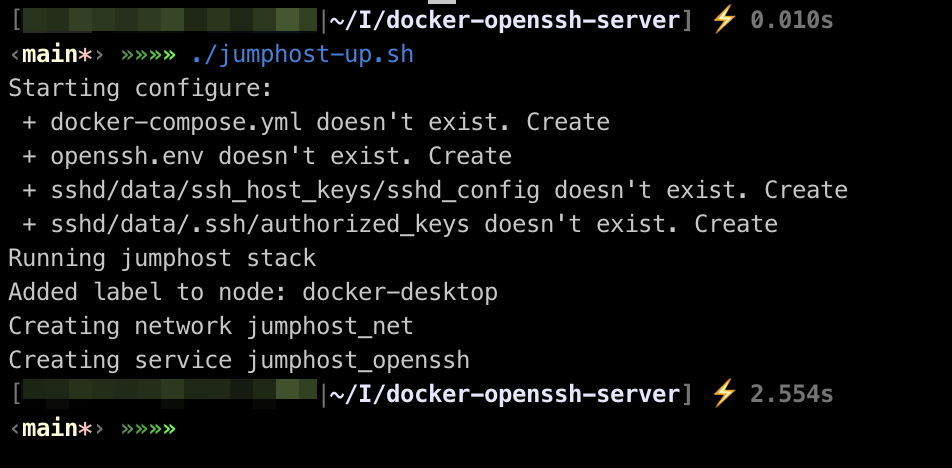
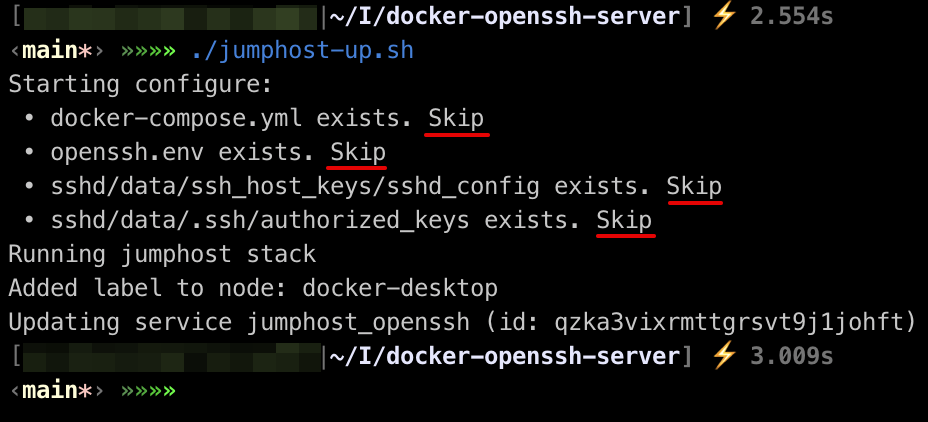

# docker-openssh-server

The prepared configuration for running OpenSSH server with expose port on a host. 

# How to use it?

1. Clone the repo to your location:
   ```shell script
   $> git clone https://github.com/cardinalit/docker-openssh-server.git
   $> cd docker-openssh-server/
   ```

2. You can run the command below:
   ```shell script
   $> ./jumphost-up.sh
   ```
   
   If the command was successful, you will see the following result:  
   
   
   
   > **NOTE**
   >
   > When you run it again, the script will not overwrite existing files in the system :)

   