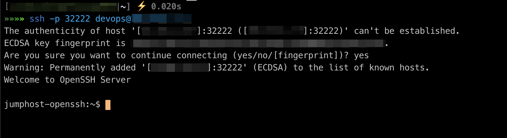

# docker-openssh-server

The prepared configuration for running OpenSSH server with expose port on a host. 

# How to use it?

1. Clone the repo to your location:
   ```shell script
   $> git clone https://github.com/cardinalit/docker-openssh-server.git
   $> cd docker-openssh-server/
   ```

2. You can run the command below:
   ```shell script
   $> ./jumphost-up.sh
   ```
   
   If the command was successful, you will see the following result:  
   
   
   
   > **NOTE**
   >
   > When you run it again, the script will not overwrite existing files in the system :)

   

3. You should add your or another user public key to `sshd/data/.ssh/authorized_keys`:
   
    3.1 Your PC:
    ```shell script
    $> cat ~/.ssh/*.pub
    ```
   
    3.2 Remote host or local:
    ```shell script
    $> echo 'ssh-rsa .......... user@PC' >> sshd/data/.ssh/authorized_keys
    ```
   
4. After you can connect to your OpenSSH server:
   ```shell script
   $> ssh -p 32222 devops@localhost
   ```
   
   
5. Enjoy!

### Example

> Example on a local machine:  
> > • Docker version: Docker version 19.03.13, build 4484c46d9d  
> > • OS: macOS Big Sur version 11.0.1

